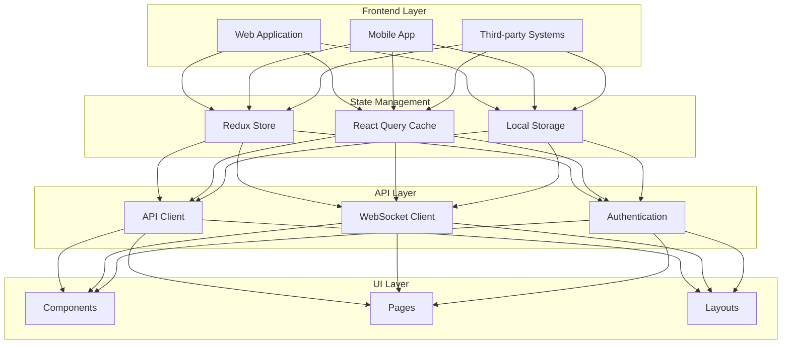

## 1. Tổng quan

Frontend của Feet Robot Manager V2 được thiết kế theo kiến trúc hiện đại, tập trung vào hiệu suất, khả năng mở rộng và bảo trì.

### 1.1 Mục tiêu
- Hiệu suất cao (FCP < 1.8s, TTI < 3.8s)
- Khả năng mở rộng tốt
- Dễ bảo trì
- Tương thích với các thiết bị
- Bảo mật cao
- Accessibility đạt chuẩn WCAG 2.1

### 1.2 Phạm vi
- Web Application
- Mobile Application
- Third-party Integration

## 2. Kiến trúc tổng thể



## 3. Cấu trúc thư mục

```
src/
├── components/         # Reusable components (xem Component_Architecture.md)
│   ├── atoms/         # Atomic components
│   ├── molecules/     # Composite components
│   ├── organisms/     # Complex components
│   ├── templates/     # Layout components
│   └── pages/         # Page components
├── hooks/             # Custom React hooks
├── services/          # API and business logic
├── utils/             # Utility functions
├── styles/            # Global styles (xem Styling_Architecture.md)
├── types/             # TypeScript types
├── assets/            # Static assets
└── tests/             # Test files (xem Testing_Architecture.md)
```

## 4. Công nghệ sử dụng

### 4.1 Core
- React 18
- TypeScript 5
- Vite

### 4.2 UI/UX
- Styled Components (xem Styling_Architecture.md)
- Material UI
- React Router (xem Routing_Architecture.md)
- React Query (xem State_Management.md)

### 4.3 State Management
- Redux Toolkit (xem State_Management.md)
- React Context
- React Query

### 4.4 Testing
- Jest (xem Testing_Architecture.md)
- React Testing Library
- Cypress

### 4.5 Development Tools
- ESLint
- Prettier
- Husky
- Commitlint

## 5. Performance Optimization

### 5.1 Core Metrics
```typescript
const performanceMetrics = {
  fcp: 1800, // First Contentful Paint (ms)
  tti: 3800, // Time to Interactive (ms)
  cls: 0.1,  // Cumulative Layout Shift
  fid: 100,  // First Input Delay (ms)
};
```

### 5.2 Optimization Techniques
- Code splitting
- Lazy loading
- Image optimization
- Caching strategies

## 6. Security

### 6.1 Authentication (xem Security_Architecture.md)
```typescript
const authConfig = {
  tokenKey: 'auth_token',
  refreshTokenKey: 'refresh_token',
  tokenExpiry: 60 * 60 * 1000, // 1 hour
  refreshTokenExpiry: 24 * 60 * 60 * 1000, // 24 hours
};
```

### 6.2 Data Protection
```typescript
const securityConfig = {
  encryptLocalStorage: true,
  encryptSessionStorage: true,
  encryptCookies: true,
  xssProtection: true,
  csrfProtection: true,
};
```

## 7. Testing Strategy (xem Testing_Architecture.md)

### 7.1 Test Coverage
```typescript
const coverageConfig = {
  statements: 80,
  branches: 80,
  functions: 80,
  lines: 80,
};
```

### 7.2 Performance Testing
- Load testing
- Stress testing
- Endurance testing
- Spike testing

## 8. Deployment (xem Deployment_Architecture.md)

### 8.1 Build Configuration
```typescript
const buildConfig = {
  outputDir: 'dist',
  assetsDir: 'assets',
  sourceMap: false,
  minify: true,
  chunkSize: 500000, // 500KB
};
```

### 8.2 Environment Configuration
```typescript
const envConfig = {
  development: {
    apiUrl: 'http://localhost:3000',
    wsUrl: 'ws://localhost:3000',
  },
  staging: {
    apiUrl: 'https://staging.api.feet-robot.com',
    wsUrl: 'wss://staging.api.feet-robot.com',
  },
  production: {
    apiUrl: 'https://api.feet-robot.com',
    wsUrl: 'wss://api.feet-robot.com',
  },
};
```

## 9. Monitoring

### 9.1 Error Tracking
```typescript
const errorTracking = {
  enabled: true,
  dsn: process.env.VITE_SENTRY_DSN,
  environment: process.env.NODE_ENV,
  release: process.env.VITE_APP_VERSION,
};
```

### 9.2 Performance Monitoring
```typescript
const performanceMonitoring = {
  enabled: true,
  sampleRate: 0.1,
  tracesSampleRate: 0.1,
  profilesSampleRate: 0.1,
};
```

## 10. Tài liệu liên quan

- [Component Architecture](2-Component_Architecture.md) - Chi tiết về cấu trúc component
- [State Management](3-State_Management.md) - Chi tiết về quản lý state
- [Routing Architecture](4-Routing_Architecture.md) - Chi tiết về routing
- [API Integration](5-API_Integration.md) - Chi tiết về tích hợp API
- [Styling Architecture](6-Styling_Architecture.md) - Chi tiết về styling
- [Testing Architecture](7-Testing_Architecture.md) - Chi tiết về testing
- [Deployment Architecture](8-Deployment_Architecture.md) - Chi tiết về deployment
- [Security Architecture](9-Security_Architecture.md) - Chi tiết về bảo mật
- [Design System](10-Design_System.md) - Chi tiết về design system 