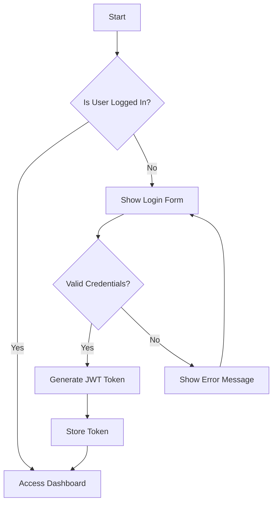
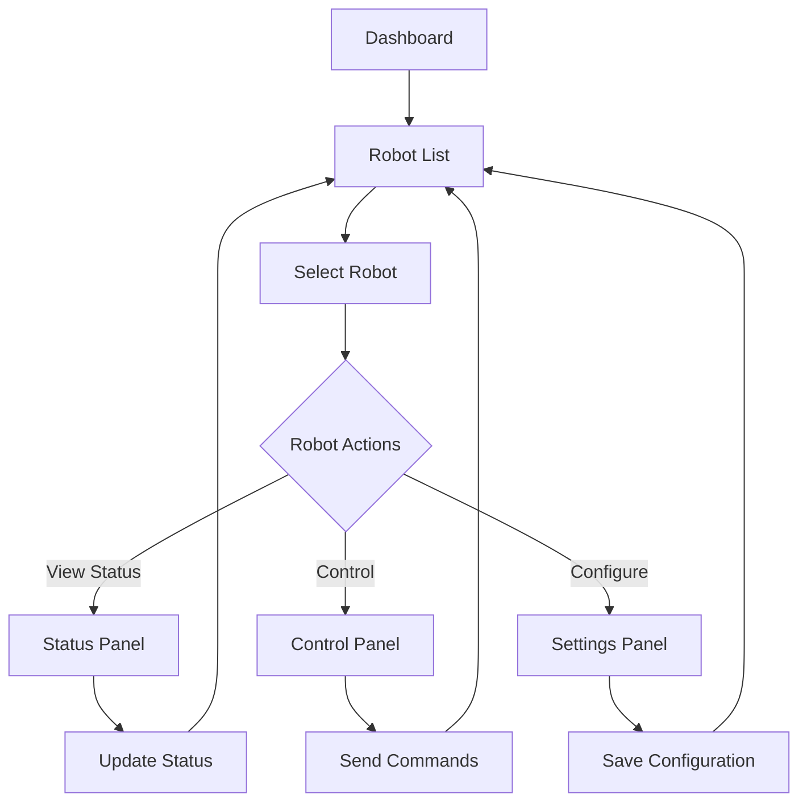
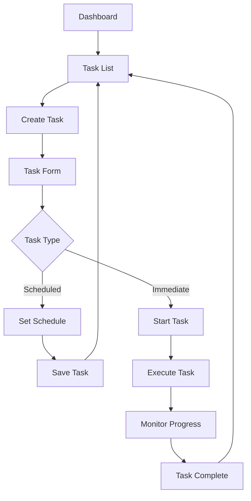
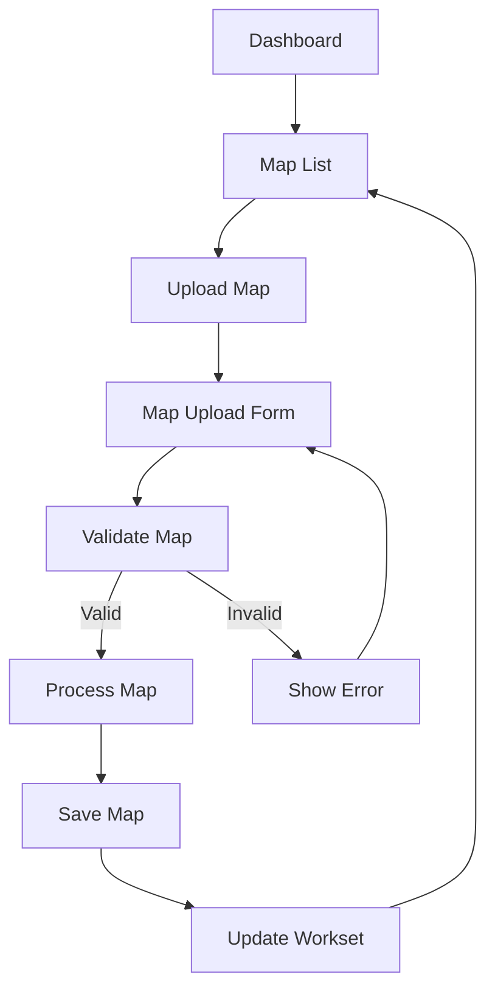
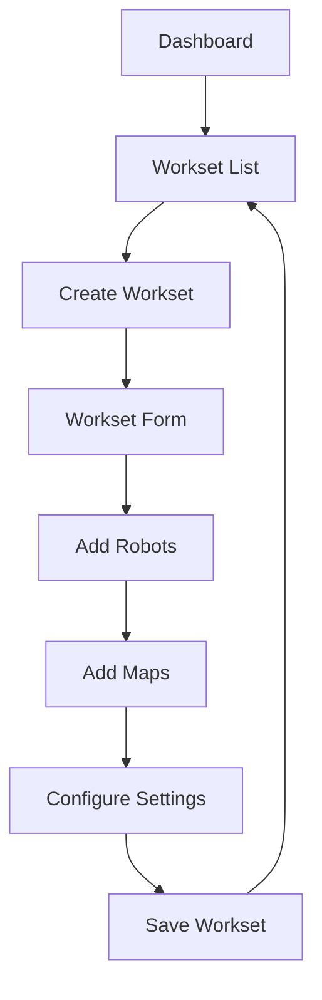
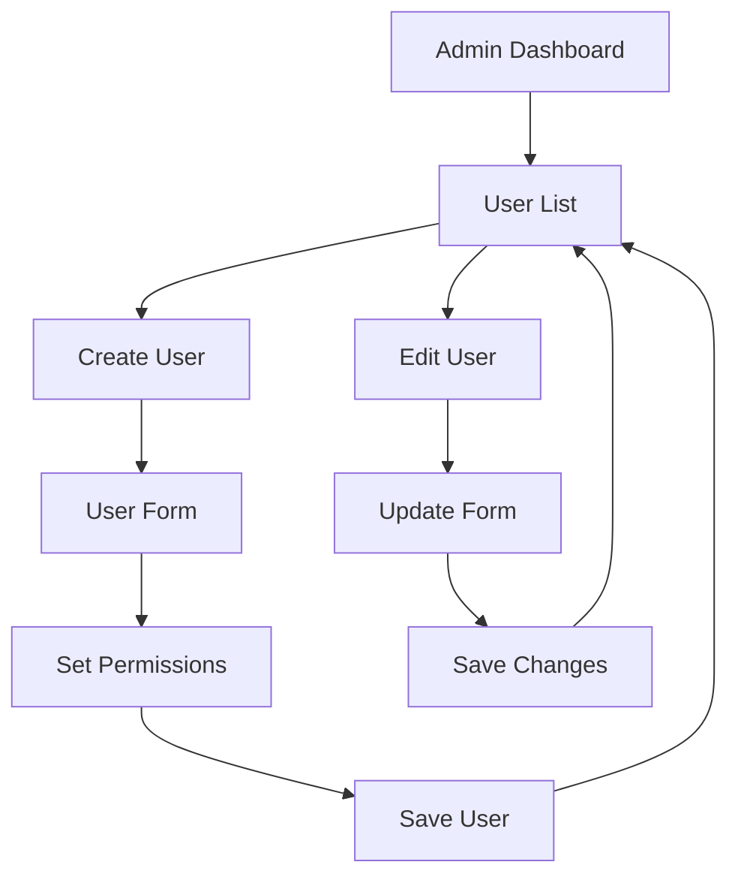
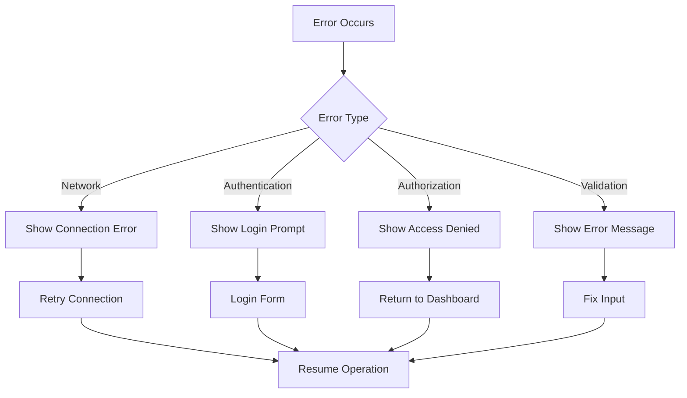
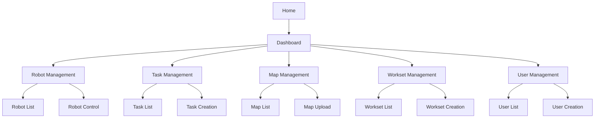
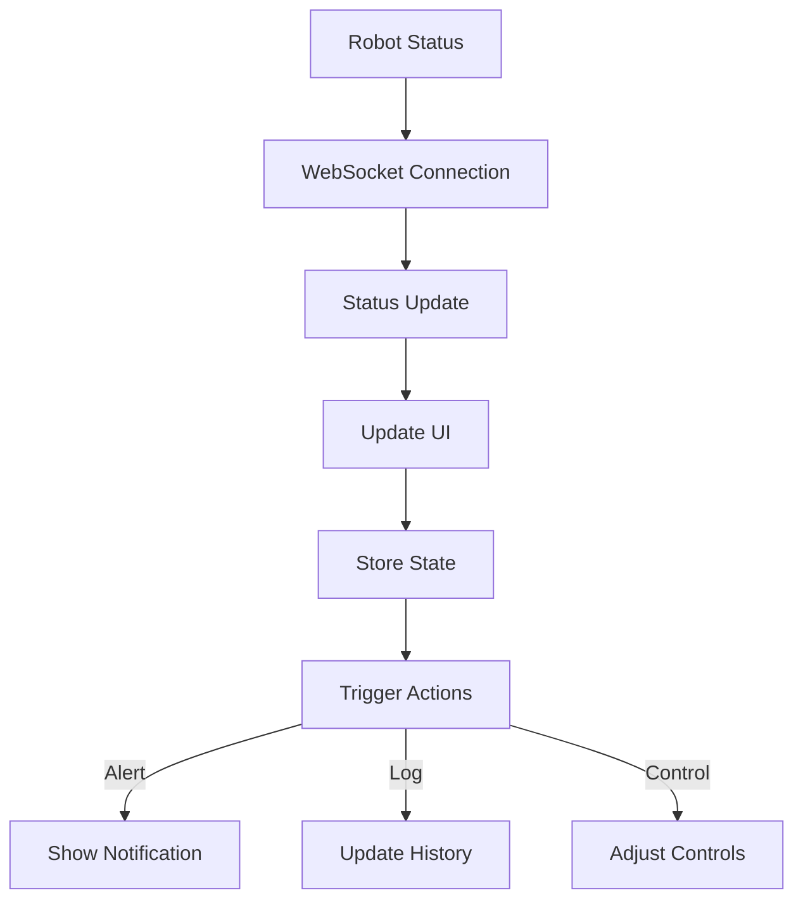
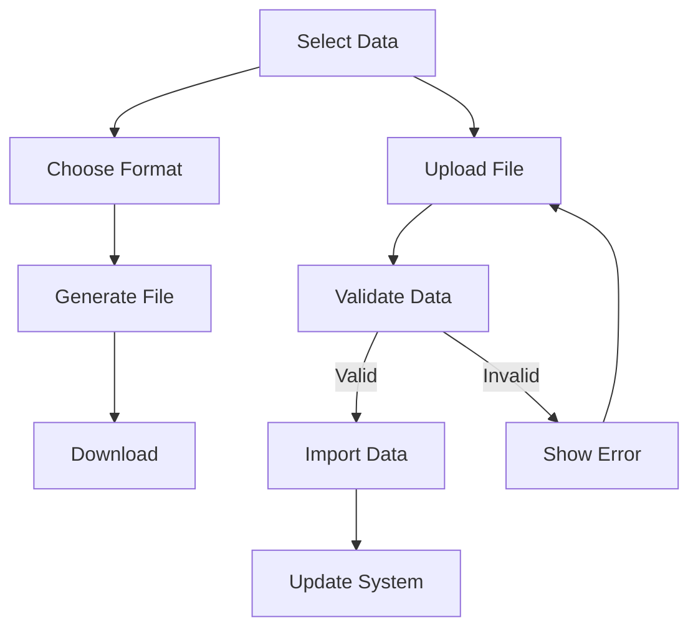

# User Flow Documentation

## 1. Authentication Flow

## 2. Robot Management Flow

## 3. Task Management Flow

## 4. Map Management Flow

## 5. Workset Management Flow

## 6. User Management Flow

## 7. Error Handling Flow

## 8. Navigation Flow

## 9. Real-time Updates Flow

## 10. Export/Import Flow

